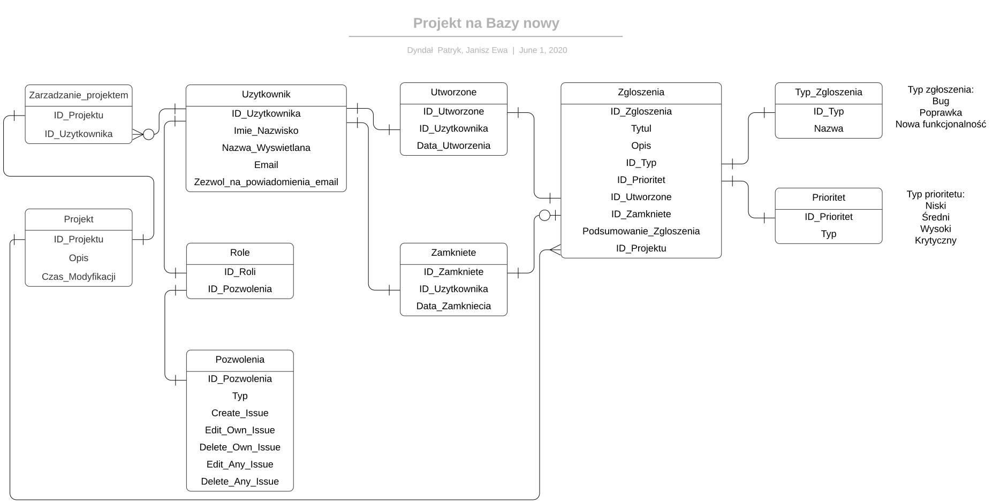

# BD_2020_Dyndal_Patryk_Ewa_Janisz

1. Typ projektu: kursowy 
2. Projekt realizowany w zespole 
3. Baza danych zaprojektowana dla sklepu internetowego.  
Baza zawiera tabele: Użytkownicy, Role, Zamówienia, Koszyki, Przesyłki, Wydziały, Magazyny, Kategorie, Przedmioty, Opinie. 
Relacje między tabelami:  
Użytkownik -> Rola - Wiele do jednego - Każdy użytkownik może mieć tylko 1 rolę  
Użytkownik -> Opinia - Jeden do wielu - Jeden użytkownik może dodać wiele opinii  
Użytkownik -> Zamówienie - Jeden do wielu - Jeden użytkownik może mieć wiele zamówień  
Zamówienia -> Koszyk - Jeden do jednego - Jeden koszyk może mieć jedno zamówienie  
Koszyk -> Przesyłki - Jeden do jednego - Jeden koszyk zawiera jedną przesyłkę  
Opinie -> Przedmiot - Wiele do jednego - Wiele opinii może być przyznanych przedmiotowi  
Przedmiot -> Kategoria - Jeden do jednego - Przedmiot może mieć tylko jedną kategorie  
Kategorie -> Magazyn - Jeden do jednego - Jedna kategoria przedmiotów znajduje się w 1 magaazynie  
Magazyn -> Wydział - Jeden do wielu - Wydział może mieć wiele magazynów  
Wydział -> Przesyłka - Jeden do jednego - Z jednego wybranego wydziału można wysłać 1 przesyłkę  

