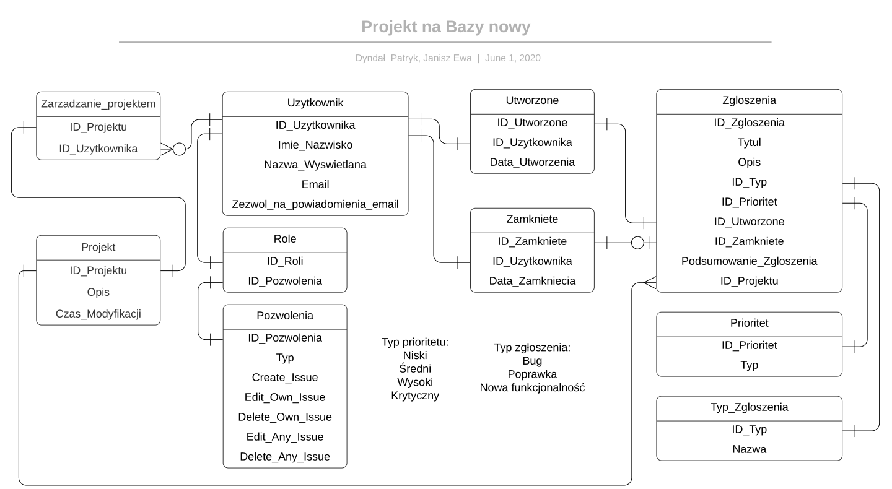

# BD_2020_Dyndal_Patryk_Ewa_Janisz

1. Typ projektu: kursowy 
2. Projekt realizowany w zespole 
3. Baza danych zaprojektowana do zgłoszeń poprawek,błędów lub nowych funkcjonalności w projektach(programach) np.sklepu internetowego 
Baza zawiera tabele: Użytkownicy, Role, Pozwolenia, Zarządzanie_projektem, Projekt,Utworzone, Zamknięte, Zgłoszenia, Priorytet, Typ_Zgłoszenia. 
Relacje między tabelami:  
Użytkownik -> Rola - Jeden do jednego - Jeden użytkownik może mieć tylko 1 rolę  
Użytkownik -> Zarządzanie projektem - Jeden do wielu - Jeden użytkownik może zarządzać wieloma projektami, opcjonalnie  
Użytkownik -> Utworzone - Jeden do jednego - Jeden użytkownik może mieć jedno utworzone zgłoszenie 
Użytkownik->Zamknięte -Jeden do jednego - Jeden użytkownik może zamknąć jedno zgłoszenie 
Utworzone-> Zgłoszenia - Jeden do jednego - Jedeno utworzone może zawierać jedno zgłoszenie  
Role -> Pozwolenia - Jeden do jednego - Jedena rola zawiera jedno pozwolenie do zmian  
Zamknięte -> Zgłoszenia - Jeden do jednego - Jedno zamknięcie może zamykać zgłoszenie, opcjonalnie  
Zgłoszenie -> Priorytet - Jeden do jednego - Zgłoszenie może mieć tylko jeden priorytet  
Zgłoszenie-> Typ_zgłoszenia - Jeden do jednego - Zgłoszenie ma jeden typ   
Projekt->Zgłoszenie -Jeden do jednego -Jeden projekt może mieć wiele zgłoszeń 

